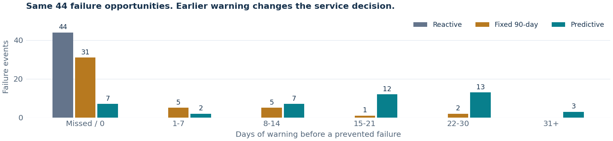
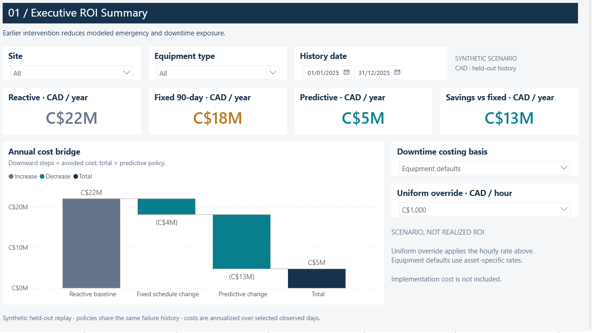
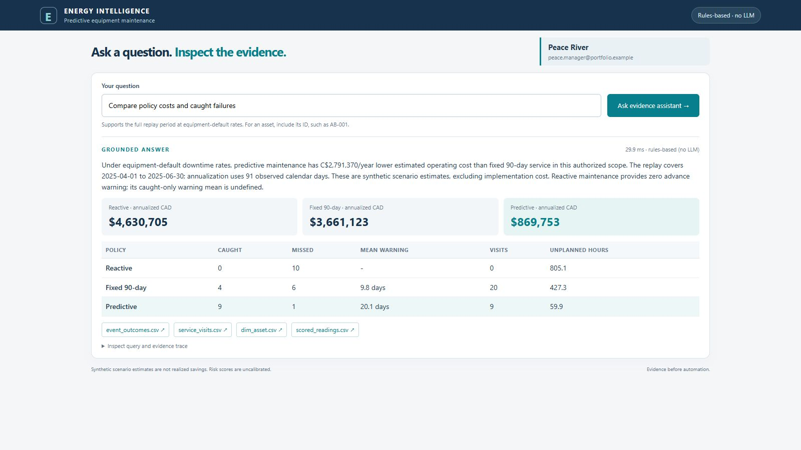
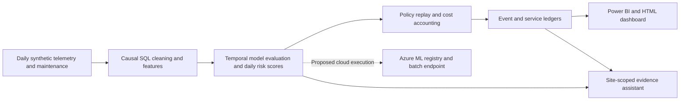

<!-- PORTFOLIO_HEADLINE:START -->
# Predictive Maintenance for Oil & Gas Operations

A reproducible maintenance decision workflow that classifies **next-30-day equipment failure** from **daily synthetic SCADA-style telemetry**, then compares predictive service with reactive repairs and fixed 90-day servicing.

*Synthetic Alberta-inspired scenario · 80 assets · 18 months of history · 91-day held-out replay · CAD estimates*

**Simulation results, not field-validated savings.** Annual costs extrapolate a deliberately failure-rich replay of the same fleet. Gross avoided repairs are already included in operating savings; incremental program costs are considered separately.

- **C$13.42M/year modeled operating savings vs. current fixed-interval maintenance.**
- **82.0% less unplanned downtime vs. current fixed-interval maintenance** (90-day servicing).
- **19-day median warning vs. current reactive maintenance's 0 days**, among 37 of 44 failures caught in simulation.
- **C$4.93M/year modeled emergency-repair avoidance vs. current reactive maintenance** (an included cost component).

    


<!-- PORTFOLIO_HEADLINE:END -->

**The business decision:** does condition-driven maintenance outperform the service calendar once unnecessary visits, missed failures and downtime are costed?

[Visual evidence](#visual-evidence) · [Policy comparison](#5-maintenance-policy-and-business-case) · [Failure findings](#failure-modes-and-measured-limits) · [Quick start](#quick-start) · [Full technical walkthrough](docs/technical-walkthrough.md)

## Review by role

| Role | Evidence to inspect |
|---|---|
| **Data Scientist** | [Model card](docs/model-card.md): causal features, temporal evaluation and validation-only threshold selection. [Generalization](docs/generalization.md): independent fleets, calibration and uncertainty. |
| **ML Engineer** | [Operating design](docs/mlops.md): provenance, batch-contract validation, quality advisories, mature-label monitoring and deployment gates. |
| **AI Engineer** | [Evidence assistant](docs/ai-assistant.md): site-scoped queries, deterministic calculations, citations and authorization/injection evaluations. |
| **Power BI / Analytics** | [Dashboard guide](docs/powerbi.md): atomic facts, filter-aware DAX, dynamic site RLS and reporting acceptance checks. |

### Visual evidence

| Power BI: Executive ROI | Assistant: policy comparison |
|---|---|
| [](screenshots/powerbi-native/01-executive-roi.png) | [](screenshots/assistant/01-policy-comparison-after.jpg) |

The [gallery](screenshots/README.md) distinguishes native Power BI output from browser demonstrations and records capture limitations.

## System architecture



The solid path runs locally. The Azure deployment definitions are supplied; cloud execution remains unvalidated.

## 1. Business problem and synthetic equipment data

[Synthetic generation](src/energy_failure/synthetic.py) produces 80 pumpjacks, compressors and pipeline pumps at fictional Alberta sites: 18 months, 43,760 daily snapshots and 236 failure events. Degradation, seasonality, noise, communication outages and invalid readings exercise the workflow.

[Source mapping](docs/sources.md) and the [data dictionary](docs/data_dictionary.md) document simplified AER-inspired fields. No operator or regulator telemetry is used; event frequency is intentionally enriched for testing.

## 2. SQL cleaning and feature engineering

[Causal cleaning](sql/01_clean.sql) deduplicates records, validates ranges and imputes from earlier valid observations. [Features](sql/02_features.sql) include 7/30-day means, change rates, missingness indicators and historical maintenance joins. These are end-of-day features, not a real-time feature store.

The reference run removes 251 duplicate readings and flags 9,298 imputed sensor cells. [Quality counts](data/processed/cleaning_quality.json) reconcile raw and cleaned output.

## 3. Python exploratory analysis

The [EDA notebook](notebooks/01_explore.ipynb) examines training-period degradation and sensor relationships. Held-out business plots are labelled separately. Rising vibration and temperature reflect the generator's programmed patterns, so they are not a field discovery. The [technical walkthrough](docs/technical-walkthrough.md) retains figures, experiment design and debugging examples.

## 4. Thirty-day failure prediction

Logistic regression and histogram gradient boosting share a 38-feature allowlist excluding identifiers, future outcomes, costs and oracle state. Calendar splits use 30-day label purges. Model and threshold selection minimize **validation policy cost among the tested candidates**.

<!-- PORTFOLIO_MODELS:START -->
| Model | Selected threshold | Average precision | Precision | Recall | Brier score |
|---|---:|---:|---:|---:|---:|
| Logistic regression | 0.85 | 0.909 | 96.3% | 58.7% | 0.043 |
| **Gradient boosting** | 0.90 | 0.931 | 99.1% | 66.2% | 0.036 |
<!-- PORTFOLIO_MODELS:END -->

Both models are evaluated on 4,880 held-out asset-days in April-May 2025. June's incomplete labels are excluded from classification metrics; policy evaluation counts observed events through June. Daily recall differs from event prevention because multiple positive days can precede one failure.

The selected scorer is **uncalibrated**. It produces risk scores for binary classification, not established failure probabilities or remaining useful life. Separate calibration experiments and conditional asset-bootstrap intervals are reported in [generalization](docs/generalization.md); they do not establish transfer to real equipment.

## 5. Maintenance policy and business case

All policies share the same 91-day history. Fixed servicing follows installation dates plus 90-day intervals, including eligible pre-period visits. Predictive servicing dispatches two days after an alert and applies a 30-day cooldown. Both intervention policies use a 30-day actionable window and 90% success assumption.

<!-- PORTFOLIO_POLICIES:START -->
| Policy | Prevented / missed failures | Planned visits in period | Unplanned hours | Total downtime hours | Total period cost, CAD |
|---|---:|---:|---:|---:|---:|
| Reactive | 0 / 44 | 0 | 3,877.0 | 3,877.0 | C$5,505,868 |
| Fixed 90-day | 13 / 31 | 81 | 2,607.1 | 3,093.1 | C$4,527,234 |
| Predictive | 37 / 7 | 51 | 469.0 | 771.0 | C$1,183,653 |
<!-- PORTFOLIO_POLICIES:END -->

**These are period totals, not annual emergency-repair costs.** They include planned service, emergency repairs and planned/unplanned downtime. [Event outcomes](data/processed/dashboard/event_outcomes.csv) and [service visits](data/processed/dashboard/service_visits.csv) expose misses and unproductive interventions. Predictive service prevents 37/41 gradual failures and 0/3 abrupt trips, which the generator defines as unpreventable.

The [capacity study](docs/operations.md) applies equal weekly limits: at three planned visits/week, predictive prevention falls to 30/44 versus 7/44 for fixed servicing. Booking uses a greedy heuristic, not route or workforce optimization. An illustrative C$192,000/year program budget plus C$75,000 implementation gives C$13.23M recurring and C$13.15M first-year savings. These are scenario inputs, not incurred costs or quotes.

Future sensors are not regenerated after prevention. This is transparent decision accounting, not a causal estimate of field savings. [Methodology](docs/methodology.md)

### Failure modes and measured limits

| Challenge | Measured finding | Interpretation |
|---|---|---|
| [Independent fleets](docs/generalization.md) | Recall falls from 66.2% to 49.8%-55.5% across three declared seeds. | One synthetic fleet overstates transfer performance. |
| [New equipment](docs/robustness.md) | Six fixtures: 0% recall across 150 positive asset-days. | Batch commissioning flags request review; they do not improve recall. |
| [Missing maintenance](docs/robustness.md) | Removing alternating repairs raises false positives from 5 to 14. | Missing history changes decisions. |
| [Sensor faults](docs/sensor-fault-tests.md) | Stuck-zero readings lower affected-cohort recall from 72.41% to 18.97%. | In-range faults pass bounds checks; no sensor diagnosis is established. |
| [Weaker interventions](reports/sensitivity.csv) | At 14 actionable days and 70% success: approximately C$884,454/year loss versus fixed. | The modeled business case can reverse. |

## 6. Azure ML pipeline and batch scoring

[Deployment definitions](deployment/) cover infrastructure, training/evaluation, registration, batch scoring and candidate validation before promotion. Local batch checks reconcile **7,280 predictions**, including complete unique row coverage, identities, scores and metadata. [Provenance](artifacts/provenance.json) and mature-label monitoring support auditability.

No Azure resources are deployed. Environment builds, permissions, endpoint execution and GitHub-hosted CI remain external acceptance steps. [Engineering evidence](docs/mlops.md)

## 7. Power BI dashboard and evidence assistant

The editable [Power BI project](powerbi/EnergyPredictiveMaintenance.pbip) uses TMDL/PBIR source, an atomic-fact star schema and 75 documented measures. Six visible pages cover ROI, policies, fleet risk, model performance, service audit and methodology.

Local validation covers Microsoft parsing, schemas, bindings and independent ledger arithmetic. Native screenshots show visible output; Desktop refresh, DAX interactions, mobile behavior, actual-viewer Service RLS and Key Influencers still require independent acceptance.

The [assistant](docs/ai-assistant.md) queries authorized records with deterministic calculations and citations. **41/41 local evaluation cases** cover grounding, unsupported questions, cross-site access and injection attempts. Its default planner is rules-based; the demonstration identity is not production authentication. Optional function calling has mock tests but no live-model evaluation. Copilot is not integrated.

## Quick start

**No installation:** browse the [screenshots](screenshots/README.md). After extracting, open [reports/portfolio.html](reports/portfolio.html) or [reports/dashboard.html](reports/dashboard.html). GitHub displays HTML source; the browser companion does not execute DAX or RLS.

For Python 3.11+, run from the extracted project root on Windows:

```powershell
python -m venv .venv
.venv/Scripts/python -m pip install -r requirements.txt
.venv/Scripts/python -m pip install -e ".[dev]"
.venv/Scripts/python scripts/launch_local.py check
```

Then use [START_LOCAL.cmd](START_LOCAL.cmd), or launch the assistant with `.venv/Scripts/python scripts/launch_local.py assistant`. On macOS/Linux, replace `.venv/Scripts/python` with `.venv/bin/python`.

To reproduce the reference analysis, run `.venv/Scripts/python -m energy_failure.pipeline --output-root .`, then `.venv/Scripts/python scripts/build_readme.py`. Regeneration replaces generated outputs. [START_HERE.md](START_HERE.md) covers the full studies and checks; [LOCAL_SETUP.md](LOCAL_SETUP.md) covers notebooks and Power BI path configuration. Reference artifacts and demo facts are included; raw/training data are [generated locally](data/README.md).

[Validation record](reports/validation.md) · [Full technical walkthrough](docs/technical-walkthrough.md) · [MIT license](LICENSE)

## About the author

I'm **Namarshi Palit**, based in **Niagara Falls, Ontario**, and open to relocating to **Alberta** for **Data Scientist, ML Engineer or AI Engineer** opportunities. My focus is turning operational data into evaluated models, traceable decisions and useful tools for engineering teams.

[LinkedIn](https://www.linkedin.com/in/namarshi-palit-1a9534186) · [GitHub](https://github.com/namarshi-data) · [Email](mailto:namarshi.palit.official@gmail.com)
