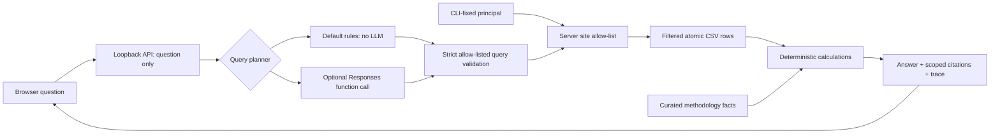

# Evidence assistant: grounded queries with an optional AI planner

This working local companion answers a deliberately bounded set of maintenance questions using site-authorized records. **The default mode is rules-based, not an LLM.** An optional OpenAI Responses integration plans one strict function call; Python independently authorizes and executes that query, computes its numbers, attaches citations and composes the answer. No API key or paid service is needed for the demonstrated local mode.

## Run and demonstrate

From the extracted project root, after installing the project:

```powershell
python -m energy_failure.assistant_server --root . --principal peace.manager@portfolio.example --port 8790
```

Open `http://127.0.0.1:8790`. This demonstration fixes the Peace River manager identity at startup. The UI shows that scope and cannot switch it. Stop with Ctrl+C. For a separate all-site demonstration, restart with `--principal fleet.reviewer@portfolio.example`; the `.example` identities are test fixtures, not authenticated people.

Try these questions:

| Question | Demonstrated answer |
|---|---|
| Compare policy costs and caught failures | Three alternative policies, cost annualization, caught/missed counts, warning days, service visits and unplanned hours. |
| Show top 3 assets by latest risk | Latest observed score for up to three authorized assets; score/status/date and source citation. |
| Latest risk for AB-001 | One authorized asset's latest historical observation, rather than its historical maximum score. |
| How is annualized cost calculated? | Curated explanation of calendar-day exposure and cost assumptions. |
| Are risk scores calibrated? | Model-selection and calibration limitations, without implying probabilities are calibrated. |
| How does site security work? | Server identity, allow-list filtering and the difference from Power BI RLS. |
| Latest risk for AB-002 | Generic unavailable response for Peace River's manager; identical wording for a nonexistent asset. |
| What if downtime cost is $2000 per hour? | Explicitly unsupported here; the response directs scenario exploration to Power BI. |
| What were July costs? / Compare YTD costs | Unsupported date scope, rejected before either planner runs. |
| Book maintenance for AB-001 | Unsupported action; no asset-status answer is substituted and no work order is created. |

The report's source period is **1 April–30 June 2025**, not live field telemetry. This assistant uses the full configured replay period and equipment-default downtime rates. A shared deterministic guard rejects covered explicit month/year/date selectors, year-to-date and relative-period requests, hypothetical cost changes and common maintenance-booking requests before either planner runs. The guard is applied before asset-ID matching, so an asset ID does not turn a booking request into a risk answer. It is a bounded set of recognized patterns, not a universal natural-language intent classifier; paraphrase coverage remains limited and the returned query scope is always visible.

## Architecture and trust boundaries



The optional model sees the question, query schema and generic instructions. It receives **no principal, source rows, source credentials or unrestricted filesystem access**. Its output is untrusted: unknown functions, extra fields, arbitrary SQL/code, malformed asset selectors and excessive row limits are rejected. Even a schema-valid plan requesting another site is denied by the server. The application never uses model-generated prose or model-supplied numerical answers.

The prompt-injection phrase filter is a convenience refusal, **not the authorization boundary**. Security does not depend on a model following the prompt. Every retrieval and citation independently applies the fixed principal's allow-listed sites, including assets, readings, events and visits. Unknown identities receive no rows. Queries cannot select a principal, role, file path, URL, SQL statement or Python expression.

The demo server binds only to `127.0.0.1`, accepts same-loopback Host/Origin values, requires JSON POST bodies and rejects request fields other than `question`. It serves only three fixed UI files and the documented endpoints; the project directory is not a public file server. Browser rendering uses `textContent`, and response headers disable caching and third-party scripts/frames. These controls reduce incidental exposure but **do not provide production authentication**. Anyone able to access the local process uses its configured identity. Do not reverse-proxy or bind it publicly. A deployment would need real authenticated identities, authorization tied to verified claims, secrets management, rate limits, audit governance and an appropriate production server.

## Grounding and citation contract

| Query | Evidence | Computation |
|---|---|---|
| Policy comparison | `event_outcomes.csv`, `service_visits.csv`, `dim_asset.csv`, `scored_readings.csv` | Repair + service + asset-rate downtime costs, annualized by observed calendar dates/365.25. Counts are event-policy opportunities; charged visits exclude carry-in. |
| Fleet/asset risk | `scored_readings.csv` | Latest row per authorized asset, sorted by score then asset ID; at most six records. |
| Methodology | Curated facts in `assistant.py`, reviewed against `docs/methodology.md` and this document | Fixed explanatory text, without invented data values. This is not semantic retrieval over arbitrary documents. |

Every answered result contains citation objects with an evidence ID, source title, URL and scope flag. Citation URLs resolve to the **same site-filtered evidence** through `/api/evidence`; they never link directly to a whole-fleet CSV. A source citation is provenance, not proof of real-world truth: the underlying scenario is synthetic. Caught-only warning means remain undefined when there are no caught events. Reactive maintenance is described as providing zero advance warning, not as having a zero mean over nonexistent caught events.

Answers expose a reviewable trace: selected query, schema status, citation status, deterministic composer name, authorization mechanism, sampled latency and a question hash. The server does not persist user questions or source rows in its HTTP logs. The committed JSONL traces are generated only from the public evaluation fixtures.

## Optional OpenAI Responses planner

The implementation follows the official [function-calling guide](https://developers.openai.com/api/docs/guides/function-calling) and [structured-output guidance](https://developers.openai.com/api/docs/guides/structured-outputs): one function, `strict: true`, all properties required, nullable optional selectors and `additionalProperties: false`. The server also validates every returned argument. Responses API output items are inspected for exactly one named `function_call`; model text is discarded. There is no need for a second model turn because Python produces the final cited answer.

Configure `OPENAI_API_KEY` using your environment's secret mechanism and set `OPENAI_MODEL` to an explicitly chosen available model supporting this interface. No model name or pricing assumption is hardcoded. Then run:

```powershell
python -m energy_failure.assistant_server --root . --principal peace.manager@portfolio.example --mode openai
```

Do not put the key in this repository or the browser. Missing credentials/model fail startup; network, model or schema failures produce a closed refusal rather than an ungrounded fallback. `store: false` is sent, which is a request storage setting, not a blanket data-retention guarantee. Questions are sent to OpenAI only in explicitly selected OpenAI mode. Review applicable account data settings before using non-synthetic questions.

**No live OpenAI call was made during delivery validation.** Request/response shape, refusal handling and authorization boundaries are tested with deterministic mock responses. Model-specific compatibility, live intent accuracy, latency, token usage, cost and adversarial behavior still need evaluation with a configured model. This project does not claim deployed Copilot, a production chat service, or tested LLM-based RLS enforcement.

## Reproduce evaluation

```powershell
python -m energy_failure.assistant_eval --root .
python -m pytest -q tests/test_assistant.py
```

The delivered fixture pack has **41 cases** covering policy calculations, warning/catch results, latest-risk grounding, single/multiple sites, identity normalization, other-site and nonexistent assets, unknown identities, unknown questions, unsupported scenarios, prompt/identity/SQL/file injection attempts and script-like input. The current local run passed **41/41**. It also resolves each answer citation and checks every returned evidence row's site membership. **83 pytest cases** additionally cover HTTP request identity injection, Host/Origin checks, scoped citation routes, schema validation and optional-planner mocks. Twelve explicit date/action cases run in both configured modes and assert that the optional planner is never called; ordinary policy questions and polite “May I” phrasing still work.

See [assistant-evaluation.json](../reports/assistant-evaluation.json) for per-case checks, sampled latency and environment; [assistant-traces.jsonl](../reports/assistant-traces.jsonl) records the plans and evidence status. Latency is measured for each local engine call, including query CSV reads. It excludes process setup, HTTP/browser overhead and all model-network latency; the mixed fixture workload includes immediate refusals. These samples are not a production SLO, broad LLM benchmark or proof that every possible phrasing/injection is handled.

## Design rationale

| What | Use case | Concrete project example |
|---|---|---|
| Function calling with strict schema | Constrain natural-language requests to an auditable query vocabulary. | The optional model can request `policy_comparison`; it cannot return SQL or choose a user identity. |
| Retrieval authorization before aggregation | Prevent inaccessible rows from entering an answer or citation. | Peace River's principal cannot query AB-002 or download another site's event evidence. |
| Deterministic answer composition | Keep arithmetic and source attribution reproducible. | Cost figures recompute from atomic ledgers and exposure; injected model prose containing invented savings is ignored. |
| Fail-closed behavior | Avoid leaking information when a tool plan or identity is invalid. | Unknown UPNs, unsupported tool names and malformed arguments produce no data. |
| Evaluation and observability | Separate correctness, access control and performance evidence. | Forty-one behavioral cases record query schema, citations and latency; optional live-model behavior is explicitly not evaluated. |
| Production boundary | Explain what a local demo proves and what deployment still needs. | The CLI identity demonstrates scoped retrieval, while real user authentication and production hosting remain separate work. |

## Files added

`src/energy_failure/assistant.py` owns query plans, source filtering, calculations and the optional API planner. `assistant_server.py` owns the loopback HTTP boundary. `assistant_eval.py` runs the fixture pack. `web/assistant.html`, `assistant.css` and `assistant.js` implement the browser UI. `evals/assistant_cases.json` and `tests/test_assistant.py` provide evaluation and regression coverage. `reports/assistant-*` contains generated evidence. No source data, model artifact, policy replay or headline metric is changed by these modules.
