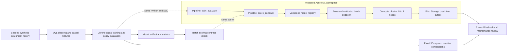

# Azure Machine Learning integration

**Delivery status: local implementation and simulation; no Azure resources have been provisioned.** The deployable assets use Azure ML CLI v2, a model registry, a training pipeline, and a batch endpoint. The repository's headline results come from the local synthetic experiment, not an Azure production system.

**Version 3 engineering:** see [MLOps implementation](mlops.md) for content-derived model identity, the verified base-image digest, advisory quality guards, local monitoring replay, CI definitions, and candidate validation before promotion. The deployment YAML model versions are explicit templates filled from the provenance manifest by `deploy.ps1`.



## What runs where

| Asset | Purpose |
|---|---|
| `deployment/main.bicep` | Workspace, Storage, Key Vault, Container Registry, and Application Insights with Log Analytics |
| `deployment/pipeline.yml` | Train/evaluate the deterministic synthetic experiment, then validate the scoring contract |
| `deployment/train-component.yml` | Run the local pipeline and expose separate model, features, and experiment outputs |
| `deployment/batch-component.yml` | Score generated features before a model is registered |
| `deployment/environment.yml`, `conda.yml` | One versioned environment for cloud training and scoring |
| `deployment/model.yml` | Optional registration of the local artifact; the deployment script defaults to a cloud-trained artifact |
| `deployment/batch-endpoint.yml`, `batch-deployment.yml` | Microsoft Entra authentication and a version-pinned model deployment |
| `src/energy_failure/batch_score.py`, `deployment/score.py` | Shared local scorer and Azure `init()` / `run(mini_batch)` adapter |
| `deployment/deploy.ps1` | Provision, train, check job success, register, deploy, invoke, and download results |

Azure ML pipeline components exchange named outputs; the batch validation component cannot run until training completes. The script registers `azureml://jobs/<job>/outputs/model/paths/` only after the full pipeline succeeds. That preserves the relationship between a model version and its training run. See the [pipeline schema](https://learn.microsoft.com/en-us/azure/machine-learning/reference-yaml-job-pipeline?view=azureml-api-2) and [model registration guide](https://learn.microsoft.com/en-us/azure/machine-learning/how-to-manage-models?view=azureml-api-2).

## Local batch simulation

From the repository root, after running the main experiment:

```powershell
python -m pip install -e .
python -m energy_failure.pipeline --output-root .
python deployment/local_smoke.py
python -m pytest tests/test_batch_score.py -q
```

The smoke test runs the Azure adapter against the real `artifacts/model.joblib` and `data/processed/batch_features.csv`. It reconciles unique source-row identifiers and asset/date identity, including reordered output, rather than relying only on equal row counts. It writes `artifacts/azure-local-smoke/predictions.csv` and `validation.json`; the evidence includes input/model SHA-256 hashes, runtime package versions, and `cloud_deployed: false`. The final local check scored all **7,280** source rows. See the [validation record](../reports/validation.md) for the full audit scope.

For a different feature file:

```powershell
python -m energy_failure.batch_score --model artifacts/model.joblib --input data/processed/batch_features.csv --output artifacts/batch-predictions.csv
```

Inputs must already contain the causal rolling features listed in the model artifact. A single raw sensor reading is insufficient to reconstruct rolling windows. The scorer selects model features in their training order, ignores unrelated metadata/labels, rejects missing or nonfinite features, and checks binary probability shape, bounds, and normalization. It preserves asset/date keys and returns the `failure_probability_30d` score, alert, threshold, and artifact version. The score is the classifier's raw probability output, not a calibrated field failure probability. Only trusted project artifacts should be deserialized with joblib.

The shared local/Azure scorer appends these advisory fields while retaining the legacy output fields:

| Output | Meaning |
|---|---|
| `risk_score` | Exact alias of `failure_probability_30d`; both contain the same uncalibrated classifier output |
| `requires_manual_review` | True when a commissioning or available data-quality guard applies |
| `review_reason` | Semicolon-separated commissioning, imputation, gap, staleness, unknown-maintenance or flatline review reasons; empty when no supplied guard applies |
| `model_artifact_sha256` | Identity of the exact serialized model used for that row |

The commissioning guard addresses a measured limitation: the frozen model produced no alerts on the controlled 0–29-day cold-start fixture. It directs those cases to a human even when the score is low. It **does not alter the score, alert threshold, or raw alert**, improve the measured recall, or create a service dispatch. Age 30 bypasses this specific guard and does not establish that an asset is safe. See the [robustness evidence](robustness.md).

When supplied, `age_days` must be finite, numeric, nonnegative, and not Boolean. Missing age produces `age_unavailable` only if the artifact does not require age as a model feature; the actual portfolio model requires it and continues to reject missing feature inputs. The normal 7,280-row held-out batch contains no assets younger than 30 days, but version 3 can still flag imputation and other observed quality issues. Separate boundary tests cover ages 0, 29 and 30 and generic missing-age inputs. The full [quality contract](mlops.md#advisory-input-quality) explains the causal history checks and their limits.

For Azure batches, `mini_batch_size: 1` means one **file**, and the shared scorer processes that file in 10,000-row chunks. Azure's adapter receives file paths and loads its artifact from `AZUREML_MODEL_DIR`; an exception plus `error_threshold: 0` fails malformed data instead of silently dropping it. See [scoring-script conventions](https://learn.microsoft.com/en-us/azure/machine-learning/how-to-batch-scoring-script?view=azureml-api-2) and the [batch deployment schema](https://learn.microsoft.com/en-us/azure/machine-learning/reference-yaml-deployment-batch?view=azureml-api-2).

## Cloud deployment, when desired

Prerequisites: an Azure subscription, permission to create the resources in the selected resource group, Azure CLI with Bicep, and regional quota for `Standard_DS3_v2`. Sign in with `az login`. Select unique workspace and regionally unique endpoint names. The script explicitly targets the supplied subscription and resource group rather than relying on saved defaults.

First parse Bicep without creating resources:

```powershell
./deployment/deploy.ps1 -SubscriptionId '<subscription-id>' -ResourceGroup 'rg-energy-demo' -WorkspaceName 'energy-demo-ml' -EndpointName '<unique-energy-batch-name>' -ValidateOnly
```

Then provision and run the cloud workflow. **This command creates billable resources and submits jobs. It has not been executed for this project.**

```powershell
./deployment/deploy.ps1 -SubscriptionId '<subscription-id>' -ResourceGroup 'rg-energy-demo' -WorkspaceName 'energy-demo-ml' -EndpointName '<unique-energy-batch-name>' -Location 'canadacentral'
```

The script upgrades the CLI `ml` extension, provisions infrastructure, registers the environment, submits the two-step pipeline, checks completion, and registers a provenance-verified model version. It creates a unique candidate, invokes that deployment explicitly, downloads and reconciles its output, then promotes it only after validation. It records the previous default and rollback arguments. Invoke is asynchronous; completion and row-level output checks precede promotion. See the [batch endpoint CLI](https://learn.microsoft.com/en-us/cli/azure/ml/batch-endpoint?view=azure-cli-latest).

The default cloud pipeline regenerates the same seeded synthetic experiment. It does not upload operational equipment records. Use `-ModelSource Local` only to test a locally trained model; the default retrains and scores under the same cloud dependency set. Give changed environments/components new versions before reuse. Version 3 pins a digest verified from the official registry; the actual environment build remains untested.

## Validation and operational limits

- Locally exercised: scoring contract tests, adapter behavior, YAML parsing, and PowerShell syntax. The generated `validation.json` is the evidence for real-artifact local scoring.
- Pending a live Azure run: Bicep compilation on Azure CLI, workspace policy/quota checks, Linux environment build, storage access, cloud pipeline execution, and endpoint scoring. Local success does not establish these cloud outcomes.
- The environment uses Python 3.11, scikit-learn 1.7.2, and NumPy 2.3.2. The supplied local run used Python 3.14 and NumPy 2.3.4. The batch runtime currently requires NumPy below 2.3.3 on Linux, so exact cross-environment numerical reproducibility is not claimed. Retraining in the registered environment avoids relying on cross-environment artifact compatibility. See [Microsoft's package metadata](https://pypi.org/project/azureml-dataset-runtime/1.62.0.post1/).
- Azure's current batch documentation still requires `azureml-core` and `azureml-dataset-runtime[fuse]` as runtime dependencies, even though the authoring interfaces here use CLI v2. The documentation identifies SDK v1 support as ended in June 2026. Review that dependency with your platform team before production use. See [batch model deployment requirements](https://learn.microsoft.com/en-us/azure/machine-learning/how-to-use-batch-model-deployments?view=azureml-api-2).
- The demo workspace uses public network access with identity-based control; private networking, customer-managed keys, managed data access, and enterprise monitoring are additional infrastructure work. No keys or credentials are embedded. The Bicep dependency pattern follows Microsoft's [workspace example](https://github.com/Azure/azure-quickstart-templates/tree/master/quickstarts/microsoft.machinelearningservices/machine-learning-workspace).
- Azure batch output ordering is not a stable join key. Reconcile `source_file` and zero-based `source_row`, plus asset/date when available. Use unique input filenames within a scoring job because `source_file` stores the basename. Microsoft's documented append-row output omits DataFrame column names; apply the scorer's current output schema, including review and artifact-identity fields, when importing a downloaded cloud CSV. The local CSV includes headers. See [batch scoring output conventions](https://learn.microsoft.com/en-us/azure/machine-learning/how-to-batch-scoring-script?view=azureml-api-2).
- A batch alert is an input to maintenance review. No work order is created automatically, and no field-tested reliability or downtime improvement is claimed.

## Cost and teardown

The compute cluster scales from zero to one node and becomes eligible to scale down after 120 idle seconds. This bounds the demo's compute footprint, while queue time and VM startup add latency. Storage, the Basic registry, logs, and other workspace resources can still incur charges when compute is idle. Obtain a regional estimate before running; the maintenance model's synthetic cost savings do not include Azure service charges. The compute controls are defined in Microsoft's [AmlCompute schema](https://learn.microsoft.com/en-us/azure/machine-learning/reference-yaml-compute-aml?view=azureml-api-2).

For a dedicated demo resource group, use the Azure Portal to review its contents and delete that group when finished. This repository does not delete Azure resources automatically.
