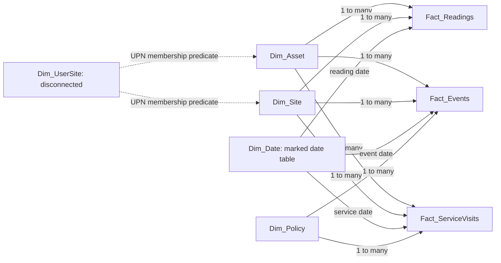

# Power BI maintenance operations dashboard

Open [EnergyPredictiveMaintenance.pbip](../powerbi/EnergyPredictiveMaintenance.pbip) in a current Power BI Desktop version with Power BI Project and enhanced report-format support. This project contains a **TMDL semantic model and PBIR report**, retained as editable, Git-diffable text. Keep it in PBIP format when saving. The former `model.bim` and aggregate-based reporting model have been replaced.

Date-axis type, category width and navigation-icon values use Microsoft's serialized enums directly. The supplied native screenshots predate a later formatting pass; fresh Desktop acceptance remains required.

**Verified locally:** Microsoft TOM parses the actual TMDL; automated checks validate official PBIP/PBIR JSON schemas, field bindings, model contracts and independent calculations from detailed CSVs. **Still requiring runtime acceptance:** Power Query refresh, DAX execution, report rendering, drillthrough, mobile layout, Key Influencers behavior and Power BI Service Viewer security. A parsed model is not evidence that those runtime steps passed. See [parser evidence](../powerbi/model_validation.json), [project validation](../powerbi/validation.json) and [data reconciliation](../powerbi/data_validation.json).

The latest counts and layout checks are recorded in [project validation](../powerbi/validation.json) and [layout validation](../reports/powerbi-layout-check.json). The model contains **75 measures**, six visible pages and three supporting views. A passing static layout check is not a claim that the report was rendered in Desktop; see the [validation record](../reports/validation.md) for current test counts.

The [offline dashboard](../reports/dashboard.html) is a separate browser companion, not a Power BI screenshot or an RLS-protected application. See the [AI and security guide](powerbi-ai-and-security.md) before presenting the Key Influencers view or discussing natural-language features.

## The operational story

| Order | Report page | Decision and evidence |
|---|---|---|
| 1 | Executive ROI Summary | Each policy's annualized cost; reactive → fixed → predictive waterfall; compact savings card and synthetic-status subtitle; downtime-cost scenario controls. |
| 2 | Policy Comparison | Caught/missed failures, warning bands and unnecessary/unsuccessful service rates; comparison axis toggles between site and asset type. |
| 3 | Fleet Risk Explorer | Six-row latest-risk queue with deterministic ties; searchable asset selection, status/date, trend and missed failures by site; asset drillthrough and compact mobile overview. |
| 4 | Model Performance | Asset-day confusion matrix, precision/recall, false-positive rate, score distribution and a button opening a full-page Key Influencers analysis. A locked page filter excludes unknown target labels. |
| 5 | Service Visit Audit | Charged visits and outcomes, including unnecessary/unsuccessful interventions; bounded outcome summaries and monthly work pattern; complete visit ledger remains in the source CSV. |
| 6 | Methodology / About | Lineage, grains, comparison assumptions, cost denominators, ML/AI limits and acceptance status. |
| Hidden | Asset Detail | Installation context, latest score/date, vibration/temperature/pressure and score trends; Back returns to fleet. |
| Hidden | AI Analysis | Full-size Key Influencers, with Back navigation to model results. |
| Hidden | Asset Context | Report-page tooltip with latest risk, status, date and interpretation guidance. |

Risk colours are paired with text: at or above the validation-selected threshold means **Inspect / dispatch**; half the threshold to below it means **Watch trend**; lower scores mean **Routine monitoring**. The default threshold is 0.90. These are review cues, not work orders or calibrated failure probabilities. Cleaned sensor readings may contain imputations; `Sensor Gap Rate` reports asset-days with originally missing readings.

Warning distributions retain a separate **31+ days** band. The replay's 30-day actionable window runs from service to failure, while warning runs from alert to failure. A two-day dispatch delay can therefore produce a 31- or 32-day alert warning; three caught predictive events fall above 30 days in the default run.

## Star schema, grains and lineage

The 16-table model includes four reporting dimensions, three atomic facts, a security mapping, configuration, explicit measures and disconnected parameter/visual-support tables. Eleven physical relationships are active, single-direction many-to-one from facts to dimensions. Dimension filters flow to facts.



Solid arrows are relationships; dotted arrows describe role predicates. There is no Site-to-Asset relationship or bidirectional security bridge. This avoids competing Site → Asset → Fact and Site → Fact paths. The asset-role predicate also hides unauthorized asset labels.

| Table | Source and grain | Default rows |
|---|---|---:|
| `Dim_Asset` | `dim_asset.csv`; one asset; descriptive fields from cleaned equipment metadata, installation date and default downtime rate | 80 |
| `Dim_Site` | `dim_site.csv`; one synthetic site; coordinates averaged from its equipment locations | 4 |
| `Dim_Date` | Power Query calendar; every date in 2025; `dataCategory: Time`, unique `Date` key | 365 |
| `Dim_Policy` | Three defined maintenance scenarios | 3 |
| `Fact_Readings` | `scored_readings.csv`; one scored asset-day, 1 April–30 June 2025 | 7,280 |
| `Fact_Events` | `event_outcomes.csv`; one physical failure per replayed policy; 44 physical events × 3 policies | 132 |
| `Fact_ServiceVisits` | `service_visits.csv`; one policy/asset visit; includes outcome and `in_evaluation_window` flag | 157 |
| `Dim_UserSite` | `dim_user_site.csv`; one allow-listed UPN/site pair; disconnected | 7 |
| `Config_Model` | `model_settings.csv`; evaluation bounds and selected alert threshold | 1 |

`Fact_Readings` intentionally has **no policy relationship**: the same sensor history is shared by every policy. Duplicating it per policy would triple-count readings and exposure. Policy filters only events and visits, whose records genuinely have a policy grain.

`policy_summary.csv` and `policy_asset_detail.csv` remain **validation references only**. `asset_summary.csv` is also excluded from the reporting model. Cost cards, event counts and latest risks calculate from atomic facts. The [dimension exporter](../scripts/export_powerbi_model_data.py) uses descriptive equipment metadata and settings, taking default downtime rates from the central `EQUIPMENT` configuration without importing aggregate outcomes.

The full synthetic dataset spans 18 months; the report imports the held-out three-month scoring/replay window plus service carry-in rows. Of 157 visits, **132 are charged inside evaluation and 25 fixed-schedule visits occurred earlier**. Cost and service-rate measures exclude the latter. The on-canvas summaries show charged visits; use the full fact/CSV and its flag to audit carry-in work.

## Measures and context

All 75 explicit measures live in [KPI_Measures.tmdl](../powerbi/EnergyPredictiveMaintenance.SemanticModel/definition/tables/KPI_Measures.tmdl). [measures.dax](../powerbi/measures.dax) is a readable mirror; [model_contract.json](../powerbi/model_contract.json) records expressions, descriptions and report bindings. Editing a mirror alone does not change the model.

Unless a comparison explicitly chooses a policy, one selected policy is evaluated. **No policy filter defaults to predictive; an explicit multiple-policy selection returns blank**, with `Policy Selection Note` explaining why. Do not add mutually exclusive maintenance scenarios. A chart with one policy per category/series has the required single-policy context.

Count measures return zero for an empty eligible set, including reactive caught events and service visits. Undefined rates still return blank: zero service visits cannot establish a false-alarm percentage. Ambiguous multi-policy measures and costs without observed exposure also remain blank.

| Measure | Definition and filter behavior |
|---|---|
| `Total Cost` | Event repair + charged planned-service cost + event downtime cost + charged planned downtime cost. Uses each related asset's default hourly rate unless Uniform override is selected. Event date recognizes repair/unplanned downtime; service date recognizes planned work. |
| `Observed Days` | Distinct dates with readings in selected site/asset/date scope, clipped to evaluation bounds. Zero-event days count. Policy cannot change exposure. |
| `Annualized Cost` | `Total Cost / (Observed Days / 365.25)`. Full-default exposure is 91/365.25, not event days, 365 calendar rows or asset-years. No observed exposure returns blank. |
| `Cost Avoided vs Reactive` | Reactive annualized cost minus selected-policy cost. Baseline uses `CALCULATE([Annualized Cost], REMOVEFILTERS(Dim_Policy), ...)`; it re-evaluates the measure in the changed context rather than reusing a frozen total variable. Site/date/asset/RLS and cost settings remain. |
| `Catch Rate` | Caught physical events / event opportunities for one policy; an intervention outcome, not classifier recall. |
| `Mean Warning Days` | Mean `warning_days` among caught events only. Reactive has no caught events, so this mean is blank; its actual warning is zero. The separate median measure supports the 19-day headline. |
| `False Alarm Rate` | `no_actionable_failure` charged visits / charged visits. Unsuccessful interventions are a separate category. Reactive has no planned visits, so its rate is blank. |
| `Classifier False Positive Rate` | FP/(FP+TN) on labeled asset-days; a different unit and denominator from operational false alarms. |
| `Latest Risk Score` | Latest observed score for each asset within selected dates. Aggregate cells average latest per-asset scores, not sums or historical maxima. |
| `Risk Score 7D Avg` | Mean risk over seven calendar days ending at the latest visible observation. Replaces only date context with that window; asset/site/RLS remain. Earlier days outside a short visible selection can contribute. Missing scores are omitted. |
| `Prediction TP/FP/FN/TN` | Asset-day counts with explicitly nonblank target and prediction. Unknown targets are never treated as negatives. `Confusion Count` maps counts to disconnected actual/predicted axes. |
| `Breakdowns` | `Missed Events`, meaning `caught = FALSE()`. Retained legacy synonyms map “breakdown” to this measure, not the Boolean column. No active Q&A visual uses them. The default policy is predictive. |

`Asset Years` is a separate diagnostic: observed asset-days/365.25. It must not replace `Evaluation Years` when annualizing whole-fleet cost. The default 80 assets contribute 19.93 asset-years across 91 calendar days.

These are estimates of avoided operating cost, not complete investment ROI: implementation, platform, monitoring and financing are not modeled. Do not add gross avoided emergency repairs to net operating-cost savings; repairs already contribute to total cost.

## Scenario and axis controls

- `Param_CostMode[Cost Mode]` defaults to **Equipment defaults**: C$650/hour for pumpjacks, C$1,400 for compressors and C$950 for pipeline pumps, preserving original results.
- **Uniform override** applies `Param_DowntimeCost[Downtime Cost Per Hour]`, a native what-if parameter from 0 to 2,500 by 50, default 1,000. Costs change live; failure outcomes, service schedules and classifier results do not.
- `Param_Breakdown[Breakdown]` toggles **Site** and **Asset type**. It uses `NAMEOF`, grouping metadata and JSON `ParameterMetadata`. It serves comparison charts; Key Influencers and the Fleet Risk missed-failure chart bind concrete fields.
- `Dim_CostStep` has three additive waterfall stages: reactive baseline, fixed-schedule change and predictive change. The native total reaches predictive cost; that amount is not added a second time as a fourth change.

## Dynamic security

The [Site Manager role](../powerbi/EnergyPredictiveMaintenance.SemanticModel/definition/roles/Site%20Manager.tmdl) normalizes `USERPRINCIPALNAME()` using `LOWER(TRIM(...))`, restricts `Dim_UserSite` to the identity and tests site membership for `Dim_Site` and `Dim_Asset`. Their relationships restrict all three facts. **Unknown UPNs receive no sites, asset labels or fact rows.**

The `.example` addresses are fixtures, not Microsoft Entra accounts or Service role assignments. Test Desktop **View as → Site Manager → Other user**, then test actual published Viewer accounts after replacing the mapping with governed UPNs and assigning membership. Workspace administrators/contributors are not the normal RLS consumer test. The [AI/security guide](powerbi-ai-and-security.md) covers deployment boundaries and external users.

Expected **raw rows without additional date/policy filters**:

| Fixture identity | Sites | Assets | Readings | Event-policy rows | All visits | Charged visits |
|---|---|---:|---:|---:|---:|---:|
| `peace.manager@portfolio.example` | Peace River | 20 | 1,820 | 30 | 34 | 29 |
| `multi.manager@portfolio.example` | Peace River + Grande Prairie | 40 | 3,640 | 48 | 74 | 62 |
| `fleet.reviewer@portfolio.example` | All four | 80 | 7,280 | 132 | 157 | 132 |
| `unknown@portfolio.example` | None | 0 | 0 | 0 | 0 | 0 |

These are fact-row counts across policies, not default predictive-only event/service measures. Slicers further narrow the authorized set and must never broaden it. Test unauthorized site selections, charts, drillthrough and cards. Any future chat deployment needs its own actual-user answer tests. Python tests establish expected counts, not Power BI enforcement.

## Open the extracted final project

Extract the ZIP to a short folder such as `C:\Portfolio\Energy` before opening it. Run this from the extracted project root:

```powershell
python powerbi/configure_local.py
```

The script finds this copy's seven dashboard CSVs, checks that all exist, and updates only `DataFolder` in the TMDL parameter, its `.pq` mirror and `model_contract.json`. It preserves report pages, measures, lineage tags and any Desktop formatting. Use `--check` for a preview or `--data-folder "C:\your\dashboard-data"` for another data directory. Run it again after moving the folder. No hardcoded author drive is required. This is an explicit local-path setup; the model does not assume that Power Query resolves relative paths against a PBIP.

Then open [EnergyPredictiveMaintenance.pbip](../powerbi/EnergyPredictiveMaintenance.pbip) and choose **Refresh**. Close an already-open project before updating its files and reopen it afterward. A fresh ZIP intentionally excludes Power BI's machine-local `.pbi` cache, so seeing the report definitions before the first refresh is expected. Keep **Fit to page** enabled. The six main pages have bounded visuals; asset lookup and drillthrough provide access beyond the six-row queue. Native dropdowns and the supporting Key Influencers visual retain their own interactive controls.

Keep the extracted path short: Power BI documents a default Windows project-path limit of 260 characters. See [Microsoft's PBIP guidance](https://learn.microsoft.com/en-us/power-bi/developer/projects/projects-overview).

## Refresh and reproducible build

Install the repository dependencies and development extras (`pytest`, `jsonschema`). Regenerate source results only when needed with `python -m energy_failure.pipeline --output-root .`, then run `python scripts/build_readme.py` to refresh the README evidence from that run. From the repository root:

```powershell
python scripts/export_powerbi_model_data.py --root .
python powerbi/configure_local.py
python powerbi/validate_data.py
dotnet restore tools/ModelValidator/ModelValidator.csproj --configfile tools/ModelValidator/NuGet.Config
python powerbi/validate_project.py --tom
python -m pytest -q
```

Use your environment's Python. Local path setup does not rebuild the report; regenerate the code-owned template only when intended with `python powerbi/build_project.py` (its default data folder is this clone's dashboard directory). `DataFolder` is in [expressions.tmdl](../powerbi/EnergyPredictiveMaintenance.SemanticModel/definition/expressions.tmdl), the retained [DataFolder.pq](../powerbi/queries/DataFolder.pq) parameter mirror and Desktop's Power Query parameter editor. Table queries live in their TMDL partitions. Other query/theme mirrors generated locally are excluded from Git and publication. The dimension exporter preserves an existing reviewed user/site mapping.

The included .NET 10 validator uses pinned official `Microsoft.AnalysisServices`; first restore requires NuGet access. `--tom` records the parsed TMDL hash; later model edits invalidate that evidence until parsing runs again. The project validator uses cached official schemas offline; add `--download` only for missing referenced schemas. See the [TOM validator](../tools/ModelValidator/Program.cs) and [project validator](../powerbi/validate_project.py) for exact checks.

1. Open the `.pbip`, confirm `DataFolder`, and **Refresh**.
2. Check row counts, date-table marking, relationships, measures and interactions below; record Desktop version and actual outcomes.
3. Save **as PBIP**, retaining `.SemanticModel/definition/` TMDL and `.Report/definition/` PBIR. Do not convert the deliverable to PBIX.
4. Validate actual Service Viewers before claiming deployed RLS. Scheduled Service refresh also requires an accessible source/credentials/gateway; publishing does not convert a local path to cloud storage.

Builders own generated model/report files; `configure_local.py` only relocates the data source. Preserve useful Desktop PBIR edits and reconcile them with the generator before rebuilding, or the generator can overwrite them. Building does not publish Power BI, deploy Azure, create users or assign roles.

## Concrete runtime acceptance checklist

Business defaults: **80 assets, all four sites, 1 April–30 June 2025, equipment-default downtime rates**. Expected values are independently computed from facts and reconciled against legacy validation references.

Run the individual blocks in [acceptance_checks.dax](../powerbi/acceptance_checks.dax) in Desktop's DAX query view after refresh. [data_validation.json](../powerbi/data_validation.json) includes each site/policy result and the uniform C$1,000/hour scenario for comparison. A `TREATAS` filter demonstrates context behavior; it does not simulate an authenticated RLS identity.

| Metric | Reactive | Fixed 90-day | Predictive |
|---|---:|---:|---:|
| Incurred cost, CAD | 5,505,868.09 | 4,527,233.55 | 1,183,652.76 |
| Annualized cost, CAD | 22,099,102.42 | 18,171,121.47 | 4,750,870.01 |
| Caught / missed events | 0 / 44 | 13 / 31 | 37 / 7 |
| Catch rate | 0.00% | 29.55% | 84.09% |
| Mean warning, caught only | Blank | 10.92 days | 20.11 days |
| Charged visits | 0 | 81 | 51 |
| Unnecessary / unsuccessful visits | 0 / 0 | 68 / 1 | 10 / 4 |
| Operational false-alarm rate | Blank | 83.95% | 19.61% |
| Unplanned downtime, hours | 3,877.0 | 2,607.1 | 469.0 |

- [ ] Cost cards/waterfall reconcile. Predictive `Cost Avoided vs Reactive` = **C$17,348,232.41/year**; savings versus fixed = **C$13,420,251.47/year**. Both are synthetic annualized estimates.
- [ ] Site/asset selections change all cost comparisons consistently. May has **31 observed days**; zero-event days contribute exposure. A period without readings returns blank annualization.
- [ ] Uniform override at zero removes only downtime cost. Moving to C$1,000 adds `1,000 × (planned + unplanned hours)` to incurred cost, without changing visits or caught events. Returning to defaults restores original totals.
- [ ] Unfiltered policy defaults to predictive; explicit multiple-policy totals are blank. Comparison charts evaluate individual policy categories correctly.
- [ ] Classifier counts: **TP 565, FP 5, FN 289, TN 4,021**, **4,880 labeled rows**, precision **99.12%**, recall **66.16%**, FPR **0.124%**. **2,400 June rows** remain censored, excluded from performance and available for fleet risk.
- [ ] One asset's latest risk matches its latest selected dated reading. Its seven-day mean respects the documented trailing window. Aggregate latest risk averages latest per-asset scores. Test a short date range and a missing-score case.
- [ ] Test site/type/date filters, field-parameter axis toggle, sorting, risk colour/text, tooltip, drillthrough/Back and Fleet Risk mobile layout after refresh.
- [ ] Test all single-site, multi-site, all-site and unknown-UPN cases against each fact and dimension labels. Repeat as actual Service Viewers before claiming deployment security.
- [ ] Fleet Risk's “Where did predictive maintenance miss a failure?” chart explicitly filters policy to predictive; missed events by site sum to **7** with all sites/assets and the full replay period selected. Site/asset/date filters and RLS must narrow this result. The Fleet page has no policy slicer; compare other policies on Policy Comparison.
- [ ] Confirm Key Influencers uses the Boolean 30-day target and excludes blanks. No Q&A question box or retirement date should remain on the report canvas. Record the visual's runtime behavior before presenting it as tested.

The retiring Q&A visual is replaced with the deterministic missed-failure chart; its existing visual identifier is retained to preserve layout references. The semantic model has Q&A disabled; legacy synonyms remain as reference metadata. Copilot requires supported paid capacity, admin configuration and an evaluated rollout; this project does not deploy it. Key Influencers shows associations in synthetic observations, not causality or the trained model's internal explanation. See the [AI guide](powerbi-ai-and-security.md) for the conflicting retirement notices, business-question definitions and future chat architecture.

Primary references: [Power BI projects](https://learn.microsoft.com/en-us/power-bi/developer/projects/projects-overview), [PBIR](https://learn.microsoft.com/en-us/power-bi/developer/projects/projects-report), [semantic-model files](https://learn.microsoft.com/en-us/power-bi/developer/projects/projects-dataset), [TMDL](https://learn.microsoft.com/en-us/analysis-services/tmdl/tmdl-overview), [star schema](https://learn.microsoft.com/en-us/power-bi/guidance/star-schema), [RLS](https://learn.microsoft.com/en-us/fabric/security/service-admin-row-level-security), and [Q&A modeling/retirement](https://learn.microsoft.com/en-us/power-bi/natural-language/q-and-a-tooling-advanced).
