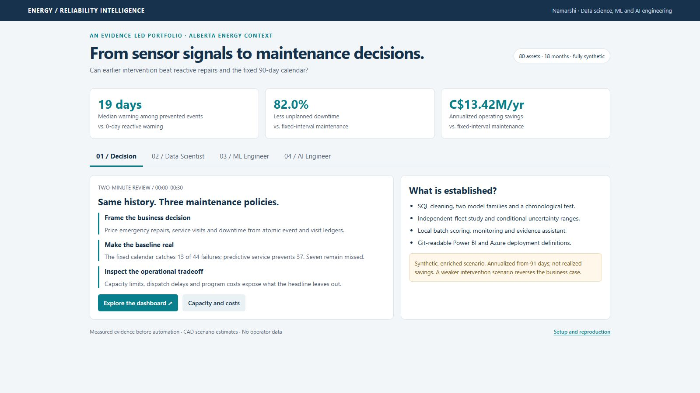
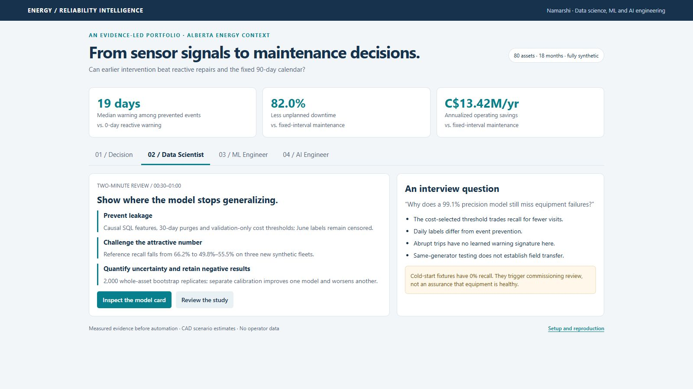
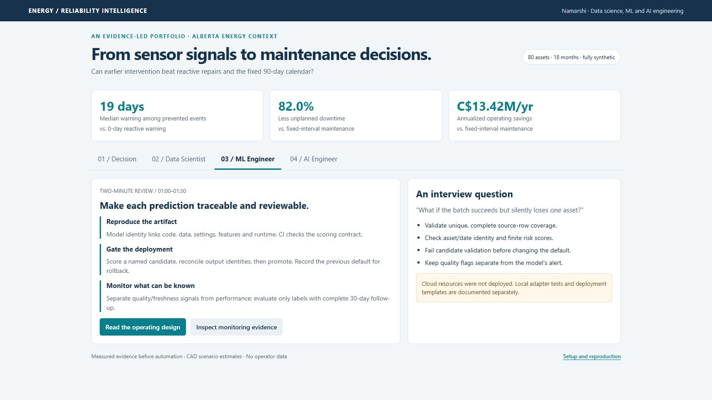
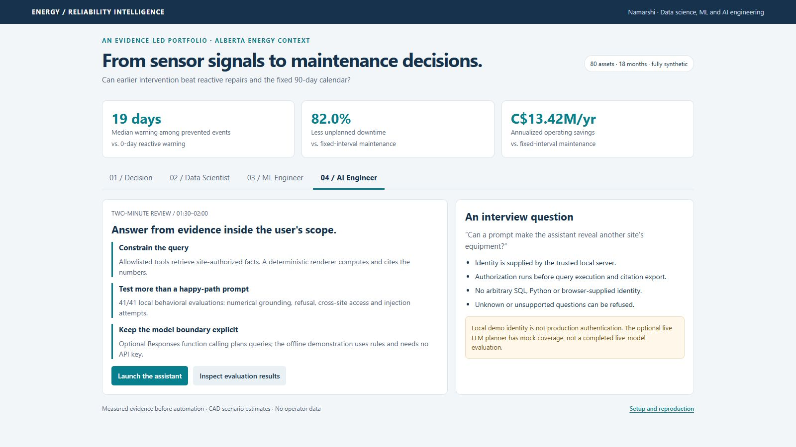
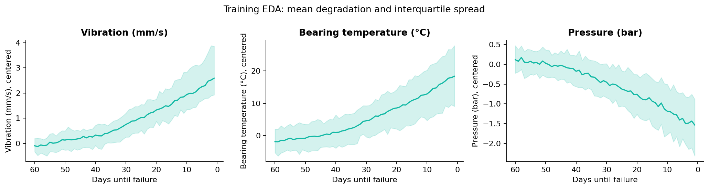
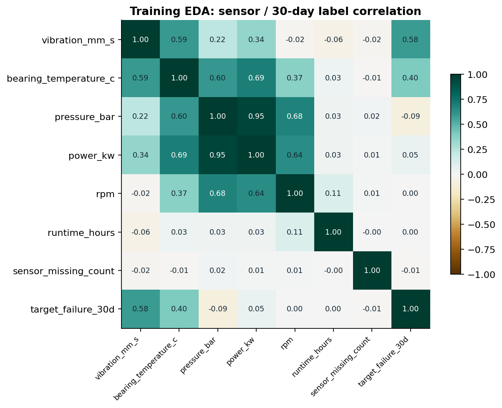
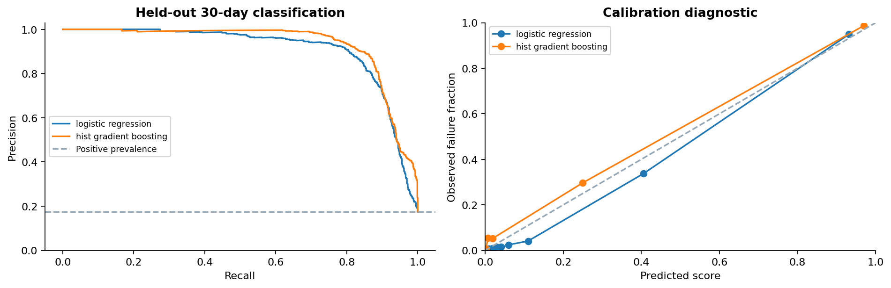
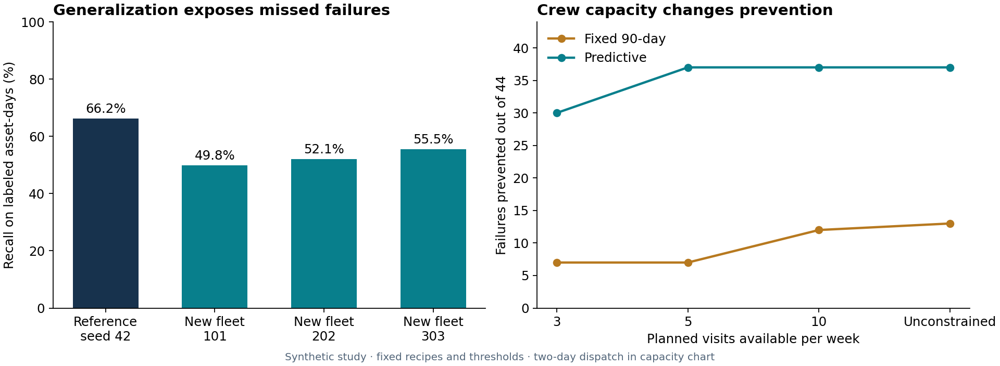
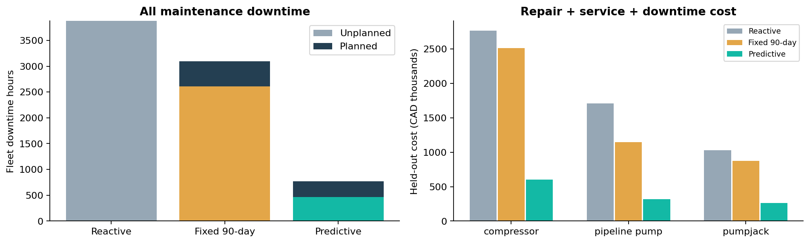
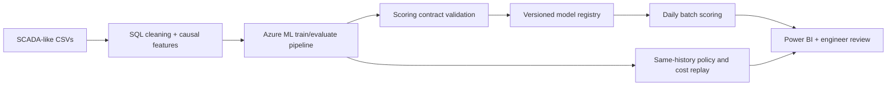

# Full technical walkthrough

This document preserves the complete technical narrative, experiments, implementation details and verification record behind the [project overview](../README.md). Use it to trace the seven project stages and inspect the supporting evidence. Recorded results describe the reference synthetic scenario; live deployment and acceptance limits are stated alongside their evidence.

<!-- PORTFOLIO_HEADLINE:START -->
## Reference scenario and results

Unplanned equipment failures drive emergency repairs and downtime; this project estimates 30-day failure risk from daily synthetic SCADA-style sensor snapshots.

*Synthetic Alberta-inspired scenario · 80 assets · 18 months of history · 91-day held-out replay · CAD estimates*

- **C$13.42M/year modeled operating savings vs. fixed 90-day servicing.**
- **82.0% less unplanned downtime vs. fixed 90-day servicing.**
- **19-day median warning vs. reactive maintenance's 0 days**, among 37 of 44 failures caught in simulation.
- **C$4.93M/year modeled emergency-repair avoidance vs. reactive maintenance** (an included cost component).

    


<!-- PORTFOLIO_HEADLINE:END -->

**Review in two minutes:** [Visual walkthrough](#visual-walkthrough) · [Results and baselines](#5-fixed-interval-and-reactive-baseline-comparison) · [Run locally](../START_HERE.md) · [All 49 screenshots](../screenshots/README.md)

These are **simulation results, not field-validated savings**. The sample deliberately contains frequent failures. Annual costs extrapolate the same 80 assets from a 91-day replay; implementation costs are outside the headline. Gross avoided repairs are already included in the operating-cost comparison, not an extra saving.

**Explore by role:** [Data Scientist](../docs/model-card.md) · [ML Engineer](../docs/mlops.md) · [AI Engineer](../docs/ai-assistant.md) · [Power BI](../docs/powerbi.md)

The full seven-part project is below. Expand the technical sections for experiments, screenshots, deployment details and verification. Raw telemetry stays local; the public repository includes code, model artifacts, curated demo facts and the complete screenshot gallery.

## What this project demonstrates

A reproducible workflow from noisy sensor data to maintenance decisions: causal SQL cleaning, chronological model evaluation, cost-based threshold selection, policy simulation, Azure ML deployment definitions, and an operations dashboard. Each result links to code or a saved evaluation artifact.

| Skill area | Where it shows up |
|---|---|
| **Data engineering** | Causal SQL cleaning with audit tables ([`01_clean.sql`](../sql/01_clean.sql), [`02_features.sql`](../sql/02_features.sql)); [quality reconciliation](../data/processed/cleaning_quality.json) from raw to cleaned rows |
| **Data Scientist** | Purged time splits, validation-only cost thresholds, a 20-asset holdout study, three independent synthetic fleets, separate calibration and 2,000 asset-cluster bootstrap replicates: [model card](../docs/model-card.md), [study](../docs/generalization.md) |
| **ML Engineer** | Code/data/environment provenance, input-quality review flags, mature-label monitoring, CI workflows and candidate validation before cloud promotion: [operating design](../docs/mlops.md), [local batch evidence](../artifacts/azure-local-smoke/validation.json) |
| **AI Engineer** | Working site-scoped evidence assistant, deterministic calculations and citations, strict optional function-calling planner and refusal/security evaluations: [architecture and launch](../docs/ai-assistant.md), [41-case evaluation](../reports/assistant-evaluation.json) |
| **Analytics engineering / BI** | Six-page Power BI report with a TMDL star schema, filter-aware DAX, dynamic site RLS, cost/field parameters, drillthrough, mobile layout and Key Influencers: [PBIP project](../powerbi/EnergyPredictiveMaintenance.pbip), [dashboard guide](../docs/powerbi.md) |
| **Software engineering** | Config-driven pipeline, seeded reproducibility, [automated tests](../tests/) covering cleaning, label horizons, and the batch prediction contract |
| **Business judgment** | Same-history reactive/fixed baselines, equal weekly service capacity, dispatch delays and incremental program costs: [operations](../docs/operations.md). A separate [sensitivity analysis](../reports/sensitivity.csv) shows the result *reverses* under weaker intervention assumptions. |

### Visual walkthrough

| Native Power BI - Executive ROI | Site-scoped assistant answer |
|---|---|
| [](../screenshots/powerbi-native/01-executive-roi.png) | [](../screenshots/assistant/01-policy-comparison-after.jpg) |

Open [the complete screenshot gallery](../screenshots/README.md) for Decision, Data Scientist, ML Engineer and AI Engineer pages; question-by-question before/after evidence; the expanded query trace; and dashboard views. The 41 browser captures and eight user-supplied native Power BI images are labelled separately. Native images cover all six main report pages, Asset Detail and Asset Context; Sensor Associations is not captured. Asset Detail and Asset Context show aggregate context, so these images do not establish asset-specific drillthrough or hover behavior. The native Fleet and Asset Detail images predate the [source formatting corrections](powerbi-report-refinement.md) and retain internal chart scrollbars; remaining Desktop checks are listed in the [dashboard guide](powerbi.md).

<details>
<summary><strong>Decision, Data Scientist, ML Engineer and AI Engineer pages</strong></summary>

| Decision | Data Scientist |
|---|---|
| [](../screenshots/reviewer-tour/01-decision.jpg) | [](../screenshots/reviewer-tour/02-data-scientist.jpg) |

| ML Engineer | AI Engineer |
|---|---|
| [](../screenshots/reviewer-tour/03-ml-engineer.jpg) | [](../screenshots/reviewer-tour/04-ai-engineer.jpg) |

The [complete gallery](../screenshots/README.md) includes 24 assistant views (welcome, eleven question/answer pairs and an evidence trace), four role pages, thirteen browser dashboard views and eight native Power BI screenshots. Open images at full size to inspect the evidence. Download and open [the interactive role tour](../reports/portfolio.html) locally; GitHub displays HTML source.

</details>

## 1. Business problem and synthetic equipment data

The portfolio question is the one a reliability team must answer: **does condition-driven maintenance outperform the actual service calendar once visits, missed failures and downtime are costed?** The setting is Alberta oil and gas: pumpjacks, compressors and pipeline pumping assets across fictional sites near Peace River, Grande Prairie, Red Deer and Lloydminster.

[`synthetic.py`](../src/energy_failure/synthetic.py) generates 18 months (January 2024-June 2025), 80 assets, 43,760 daily snapshots and 236 failure events. Vibration, temperature, pressure, RPM, runtime, load and power combine degradation, transient operating changes, seasonal variation and noise. Communication outages last 2–5 days; retransmissions and invalid readings exercise the cleaning stage.

Equipment, event, licence, cause and location fields use a simplified AER-inspired structure. Timestamped values with data-quality flags reflect historian concepts. Daily snapshots deliberately simplify a historian; they do not support high-frequency waveform diagnostics or real-time control. This is not an AER schema clone or a model trained on regulator telemetry. [Source mapping](../docs/sources.md) · [data dictionary](../docs/data_dictionary.md)

## 2. SQL cleaning and feature engineering

[`01_clean.sql`](../sql/01_clean.sql) removes duplicates, normalizes keys, validates readings and uses only earlier observations for imputation. [`02_features.sql`](../sql/02_features.sql) adds 7/30-day means, rates of change, communication-gap flags, installation age inputs and historical maintenance joins.

The default run removes 251 duplicate readings and marks 9,298 imputed sensor cells. Flags remain available to the model and dashboard. The SQLite database preserves raw and intermediate audit tables; [quality counts](../data/processed/cleaning_quality.json) reconcile ingestion to cleaned output.

## 3. Python exploratory analysis

[`01_explore.ipynb`](../notebooks/01_explore.ipynb) and [`reporting.py`](../src/energy_failure/reporting.py) provide the reproducible analysis. Sensor exploration uses the training interval only. Business-cost plots use the held-out policy replay and are labelled separately.

<details>
<summary><strong>EDA figures: degradation trends and sensor correlations</strong></summary>



The training-period averages show rising vibration and bearing temperature, with falling pressure, as simulated failures approach. These patterns reflect the generator's programmed degradation scenarios. The 30-day prediction horizon represents the project's maintenance-planning target.



Vibration and bearing temperature show stronger linear association with the 30-day label than pressure and power. The heatmap also exposes correlations between sensors. Weak linear correlation alone does not rule out useful nonlinear or time-dependent predictive information.

</details>

## 4. Thirty-day failure prediction

The project compares a scaled, balanced **logistic regression** with **histogram gradient boosting**. A 38-feature allowlist excludes asset identifiers, future outcomes, cost fields and oracle state. Calendar splits have 30-day label purges; June's incomplete labels are excluded from classification evaluation. No random row split or test-set threshold tuning is used.

The model and threshold are selected by the lowest **validation maintenance-policy cost** among the evaluated candidates, accounting for expensive missed failures and unnecessary visits. The selected model is histogram gradient boosting at a 0.90 threshold. This is a cost-based selection within the declared model and threshold grid, not a claim of globally optimal dispatch.

<!-- PORTFOLIO_MODELS:START -->
| Model | Selected threshold | Average precision | Precision | Recall | Brier score |
|---|---:|---:|---:|---:|---:|
| Logistic regression | 0.85 | 0.909 | 96.3% | 58.7% | 0.043 |
| **Gradient boosting** | 0.90 | 0.931 | 99.1% | 66.2% | 0.036 |
<!-- PORTFOLIO_MODELS:END -->

Both models are evaluated on the same **4,880 held-out asset-days**, from 1 April to 31 May 2025, at thresholds chosen on validation data. These daily metrics differ from event-level prevention: several positive days can precede one failure. The policy replay continues through 30 June, when all observed failure events can be counted.

<details>
<summary><strong>Inspect precision/recall tradeoffs and calibration</strong></summary>



Gradient boosting has higher held-out average precision and a lower Brier score in this synthetic sample. The headline model's calibration plot is a diagnostic; the deployed artifact remains uncalibrated. A separate development calibration experiment is reported below and is not promoted into the scorer. Outputs remain **risk scores**, without claiming calibrated failure probabilities or performance on real equipment.

[Validation threshold/cost tradeoffs](../reports/validation_threshold_tradeoffs.csv) · [test metrics](../reports/test_models.csv) · [machine-readable run manifest](../artifacts/metrics.json)

</details>

<details>
<summary><strong>Generalization, incomplete history, sensor faults and cold-start tests</strong></summary>

### Does it generalize beyond one synthetic fleet?

Version 3 records a protocol before evaluating new seeds **101, 202 and 303**. Reference-model recall falls from **66.2% to 49.8%–55.5%**, while precision remains 98.0%–99.3%. All seeds are reported. A separate 60-asset model excludes 20 assets from fitting and threshold selection; because the original seed was already explored, that split is explicitly a retrospective diagnostic.

Calibration on independent development seed 77 improves reference Brier scores but worsens the 60-asset study model's Brier scores on all three external fleets. Neither experiment changes the reference scoring threshold. Whole-asset bootstrap resampling gives a **57.3%–74.5% conditional recall range** and **C$9.03M–C$18.23M conditional annual operating-savings range**. These ranges do not include generator misspecification, fitting uncertainty or field transfer risk.



[Protocol and complete results](../docs/generalization.md) · [Model card](../docs/model-card.md) · [Bootstrap outputs](../reports/uncertainty_intervals.csv)

### Tested against difficult operating conditions

The selected algorithm, features and threshold remain frozen for these stress checks. They are separate from the headline replay; unfavorable results are retained.

| Challenge | Measured result | Operational meaning |
|---|---|---|
| Incomplete maintenance history | Removing alternating recorded repair entries raises held-out false positives from **5 to 14**, with precision **99.1% → 97.6%** over the same 4,880 asset-days. | The model lacks a learned completeness feature. Version 3 adds an advisory for no recorded history; it cannot detect every partial export or restore the missing information. |
| Gradual versus abrupt failures | Predictive replay prevents **37/41 gradual failures** and **0/3 abrupt electrical trips**. | The generator makes abrupt trips nonpreventable. Separate model-recall-by-mode results distinguish this assumption from classifier behavior. |
| A sensor drifting versus failing suddenly | Separate controlled vibration-sensor drift, stuck-zero and dropout experiments rerun SQL features while preserving the equipment outcomes. | These test robustness to a malfunctioning sensor, separately from equipment degradation. The predictor is not a sensor-fault diagnostic model. [Measured results](../docs/sensor-fault-tests.md) |
| Newly installed equipment, ages 0–29 days | Six controlled units produce **0 alerts across 150 positive asset-days**; recall is **0%**. | These ages and short histories are outside the training fleet. The batch adapter flags commissioning/manual review; a low score cannot establish that a new unit is healthy. |

Cold-start fixtures have fresh installation dates, low cumulative runtime, no inherited readings or maintenance, and complete future label coverage. They are deliberately enriched challenges, not a new-fleet prevalence estimate. [Experiment design and results](../docs/robustness.md) · [machine-readable evidence](../reports/robustness.json)

</details>

### Engineering notes: three edge cases worth knowing about

<details>
<summary><strong>Three concrete examples, with measured outcomes</strong></summary>

**Communication gaps masquerading as sensor changes.** A three-day gap filled with zero produces an artificial **−3 mm/s/day** vibration drop and one false drop-rule flag. Causal carry-forward removes that artificial drop while retaining explicit missingness flags on all three days. This regression case is reproducible; the drop rule is illustrative, not the trained classifier. Removing the model's three gap predictors gives **5 false positives both with and without them**, so the experiment establishes no false-positive reduction from those three predictors. [Gap experiment](../docs/robustness.md)

**Currency formatting needs a literal prefix.** The retained Executive Insight measure formats the number first and prefixes `C$` separately: `"C$" & FORMAT(ABS(Savings), "#,##0", "en-CA")`. The source validator guards this expression so the currency prefix is not reintroduced into the numeric format template. This source check does not execute Power BI DAX or verify a Desktop render. [DAX reference](../powerbi/measures.dax) · [Source validator](../powerbi/validate_project.py)

**Batch success could hide missing rows.** Matching input/output counts alone could accept a duplicate while omitting another input. The local adapter check now requires unique, complete source-row coverage and matching asset/date identities, with regression tests for malformed output. [Azure integration](../docs/azure.md)

</details>

## 5. Fixed-interval and reactive baseline comparison

The fixed policy services each asset at its installation date plus multiples of 90 days. It gets credit for existing pre-test visits that can prevent early test failures. The predictive policy starts at the test boundary, dispatches two days after an alert, and applies a 30-day cooldown after service. Both use the same 30-day actionable window, shared intervention-success draws and 90% success assumption.

<!-- PORTFOLIO_POLICIES:START -->
| Policy | Prevented / missed failures | Planned visits in period | Unplanned hours | Total downtime hours | Total period cost, CAD |
|---|---:|---:|---:|---:|---:|
| Reactive | 0 / 44 | 0 | 3,877.0 | 3,877.0 | C$5,505,868 |
| Fixed 90-day | 13 / 31 | 81 | 2,607.1 | 3,093.1 | C$4,527,234 |
| Predictive | 37 / 7 | 51 | 469.0 | 771.0 | C$1,183,653 |
<!-- PORTFOLIO_POLICIES:END -->

<details>
<summary><strong>Cost breakdown, service capacity, program costs and adverse scenarios</strong></summary>



Predictive maintenance reduces simulated unplanned downtime from **2,607.1 to 469.0 hours** versus the fixed schedule. **Seven failures remain missed.** The cost chart includes planned service and downtime, so unnecessary interventions still count against the predictive policy.

The event ledger shows **exactly what the 90-day schedule catches and misses**: [event outcomes](../data/processed/dashboard/event_outcomes.csv). The [service ledger](../data/processed/dashboard/service_visits.csv) includes unproductive visits, unsuccessful interventions and pre-period carry-in visits. Every in-period visit is charged.

Total cost includes emergency repairs, scheduled service, and both planned and unplanned downtime. The C$4.93M gross emergency-repair figure is already part of the overall economics; do not add it to net savings. Cloud, implementation and program staffing costs remain outside the headline and are included separately below.

**Operational extension:** eight scenarios apply equal weekly planned-visit limits to fixed and predictive policies, using only known schedules and current risk scores. At three visits/week and two-day dispatch, predictive prevention falls from 37 to **30/44**, versus **7/44** for the constrained fixed calendar. At five visits/week it returns to 37/44. This is a greedy booking heuristic, not route optimization or calibrated expected-value ranking. [All scenarios and assumptions](../docs/operations.md)

An illustrative **C$192,000/year incremental program budget** plus **C$75,000 implementation** reduces the reference's C$13.42M operating advantage to **C$13.23M recurring net program savings** and **C$13.15M first-year savings**. The authored inputs are scenario assumptions, not actual staffing costs or cloud quotes. [24-row economics grid](../reports/operations_economics.csv)

**Stress test:** with only 14 actionable days and 70% intervention success, this same model/threshold loses approximately **C$884,454/year vs fixed maintenance**. No favorable result is guaranteed. [All 12 scenarios](../reports/sensitivity.csv)

This shared-history replay never regenerates future sensors after prevention. It demonstrates decision accounting, not a causal estimate of field savings. [Full counterfactual assumptions](../docs/methodology.md)

</details>

## 6. Azure Machine Learning pipeline, registry and batch scoring

[`deployment/`](../deployment/) contains Bicep infrastructure, CLI v2 components/pipeline, an environment definition, versioned model registration, a batch endpoint, and a PowerShell deployment script. The architecture and proposed production flow are described in [Azure integration](../docs/azure.md).

Proposed Azure workflow; cloud execution has not been validated:



<details>
<summary><strong>Batch contract, provenance, monitoring and deployment gates</strong></summary>

The Azure adapter was exercised locally on **7,280 rows**, checking complete unique source-row coverage and matching identities, scores, review flags and model metadata. The model now has a content-derived identity and [provenance manifest](../artifacts/provenance.json). Scoring adds advisory flags for imputed/stale readings, unknown maintenance and commissioning conditions without changing the raw alert. [Local adapter evidence](../artifacts/azure-local-smoke/validation.json)

The deployment script invokes a named candidate, reconciles downloaded predictions, checks for an intervening default change and only then promotes it. The previous default is recorded for rollback. The environment uses a verified Microsoft image digest. Pull-request and full benchmark CI definitions are included; local monitoring demonstrates data-quality and delivery-delay findings with performance calculated only on mature labels. [Engineering design and evidence](../docs/mlops.md)

**No Azure resources are deployed.** Live environment build, Bicep compilation, permissions and endpoint execution remain cloud validation steps. GitHub-hosted workflow execution is also pending.

</details>

## 7. Power BI maintenance-ops dashboard and delivery

The editable [PBIP project](../powerbi/EnergyPredictiveMaintenance.pbip) uses **TMDL and PBIR source files**, preserving readable Git diffs. Its six visible pages follow a decision workflow: **Executive ROI Summary → Policy Comparison → Fleet Risk Explorer → Model Performance → Service Visit Audit → Methodology / About**. Hidden asset-detail, contextual-tooltip and full-page AI analysis views support investigation.

<details>
<summary><strong>Star schema, DAX, dynamic RLS, scenarios, AI visuals and acceptance status</strong></summary>

The model relates `Dim_Asset`, `Dim_Site` and a marked `Dim_Date` to three atomic fact tables through single-direction relationships. `Dim_Policy` filters events and visits; readings remain shared, policy-independent observations. All reporting costs come from event and service ledgers. Pre-aggregated CSVs serve only as reconciliation references.

The report includes 75 documented measures, dynamic **Site Manager** RLS through `Dim_UserSite` / `USERPRINCIPALNAME()`, a live downtime-cost scenario, site/type field switching, risk colors and text, sensor drillthrough, and a Fleet Risk mobile layout. Default equipment rates preserve the published result; choosing **Uniform override** makes the hourly-cost control change every policy's costs in the same filter scope. Fictional access mappings must be replaced before deployment.

Fleet Risk answers **“Where did predictive maintenance miss a failure?”** with a standard bar chart of missed events (`caught = false`) by site, explicitly scoped to predictive maintenance. Site, asset and date selections continue to filter the chart. The retiring Q&A visual has been replaced; its curated vocabulary remains as legacy metadata. **Key Influencers** opens from Model Performance in a dedicated analysis view and explores sensor associations with observed 30-day labels. **Copilot is not integrated**: the [AI and security guide](../docs/powerbi-ai-and-security.md) documents the retirement notices, deployment requirements and a future evaluation plan. [Microsoft Q&A limitations](https://learn.microsoft.com/en-us/power-bi/natural-language/q-and-a-limitations)

The desktop page definitions use a **1280 × 720 Fit-to-page layout**, restrained navy/teal colours, bounded summaries and a deterministic six-asset risk queue. Asset search and drillthrough retain access to the wider fleet; visit-level CSVs retain the full audit trail. The [formatting note](powerbi-report-refinement.md) explains the serialized date-axis, category-width and navigation-icon corrections and their remaining native acceptance checks.

The [dashboard guide](../docs/powerbi.md) explains model design, filter behavior and deployment checks in full.

**Verified locally:** Microsoft's TMDL parser, official JSON schemas, visual bindings, and independent ledger arithmetic. Eight supplied native screenshots document visible report output. **Independent acceptance still pending:** Power BI Desktop refresh, DAX interactions, mobile behavior, actual-viewer Service RLS and Key Influencers behavior. A parsed definition and screenshots do not establish those runtime outcomes.

The measure table uses `KPI_Measures` (Power BI reserves the name `Measures`); validation also rejects incomplete page/visual directories left by an external file update.

The [offline HTML companion](../reports/dashboard.html) offers an account-free demonstration of the same decision workflow from atomic CSV records. Download/clone and open it in a browser; GitHub displays HTML source rather than executing it. It does not run Power BI, DAX, RLS or native AI. After extracting the ZIP, run `python powerbi/configure_local.py` to point **DataFolder** to this copy's data without rebuilding the report, then open the PBIP and **Refresh**. Keep saving as **PBIP**.

</details>

### Evidence assistant and AI engineering

The [local evidence assistant](../docs/ai-assistant.md) answers policy-cost, latest-risk and methodology questions from authorized sources. The server fixes identity, filters facts and citations by site, validates allowlisted query arguments and renders numerical answers deterministically. It refuses unsupported scenarios and unknown identities rather than inventing an answer. The **41/41 local evaluation cases** include numeric grounding, cross-site access and injection attempts.

The default demonstration is explicitly rules-based. An optional OpenAI Responses function-calling planner translates questions into the same bounded query contract; its integration has mock tests but has **not** been evaluated against a live model. Records are queried from structured CSVs, and methodology answers use curated facts. There is no vector database, embedding search or semantic retrieval over arbitrary logs. Python composes answers and calculates their numbers. This is a separate companion, not an embedded Copilot feature. [Architecture, trust boundaries and examples](../docs/ai-assistant.md)

## Reproduce locally

A reviewer can start with [screenshots](../screenshots/README.md) without installing anything. After cloning or extracting, open [reports/portfolio.html](../reports/portfolio.html) for the tour, or follow [LOCAL_SETUP.md](../LOCAL_SETUP.md) to install once and use **START_LOCAL.cmd**. [START_HERE.md](../START_HERE.md) contains the ordered reproduction workflow.

<details>
<summary><strong>Full reproduction commands and generated-file behavior</strong></summary>

Use Python 3.11 or later from the repository root. The checked-in result was run with Python 3.14 and scikit-learn 1.7.2. Local dependencies are pinned in `requirements.txt`; Azure's separately pinned environment uses a compatible lower NumPy version required by its batch runtime.

```powershell
python -m venv .venv
.venv/Scripts/python -m pip install -r requirements.txt
.venv/Scripts/python -m pip install -e ".[dev,notebook]"
.venv/Scripts/python -m energy_failure.pipeline --output-root .
.venv/Scripts/python -m energy_failure.robustness --root .
.venv/Scripts/python -m energy_failure.sensor_faults --root .
.venv/Scripts/python -m energy_failure.generalization --root .
.venv/Scripts/python -m energy_failure.operations --root .
.venv/Scripts/python -m energy_failure.uncertainty --root .
.venv/Scripts/python -m energy_failure.monitoring --root .
.venv/Scripts/python -m energy_failure.assistant_eval --root .
.venv/Scripts/python deployment/local_smoke.py
.venv/Scripts/python scripts/build_portfolio.py
.venv/Scripts/python scripts/build_readme.py
.venv/Scripts/python -m pytest -q
.venv/Scripts/python powerbi/configure_local.py
.venv/Scripts/python powerbi/check_layout.py
.venv/Scripts/python powerbi/validate_data.py
.venv/Scripts/python powerbi/validate_project.py
```

On macOS/Linux, use `.venv/bin/python` instead. The default pipeline overwrites its generated output files reproducibly with seed 42. It rebuilds raw/clean data, the model, metrics, plots, sensitivity results and the offline dashboard. It requires no Azure account. The optional notebook dependencies above install Jupyter; analysis functions are also executed by the pipeline. After regenerating the evidence, run `python scripts/build_readme.py` to refresh the root README's marked headline, model table, policy table and lead-time chart. It preserves authored text outside its markers and refuses incomplete or duplicate markers. Use `--check` to verify the generated sections without changing files. This technical walkthrough is a recorded snapshot and is not rewritten by that script; review its narrative and tables when results or assumptions change.

The GitHub tree includes the reference model, source, curated dashboard facts and all 49 screenshots. Raw telemetry and full training intermediates are generated locally and ignored by Git. [Publication policy](../data/README.md). Adjust assumptions in [`config.py`](../src/energy_failure/config.py), rerun, and review all comparison results rather than keeping the original claims. The pipeline also exports BI dimensions/settings and preserves an existing user/site mapping. For path changes use `configure_local.py`. Only use `python powerbi/build_project.py --data-folder "YOUR/PROJECT/data/processed/dashboard"` when intentionally rebuilding generated report definitions; that replaces report customizations. The [dashboard guide](../docs/powerbi.md) covers the .NET TOM parser and refreshing validation evidence after model edits.

</details>

## Verification

The recorded evidence includes **41 assistant evaluation cases** and **7,280 reconciled batch predictions**. Use the [validation record](../reports/validation.md) for dated test runs and the scope of checks performed on the current publication; the checks below describe the retained experiment evidence.

<details>
<summary><strong>Detailed verification evidence and external checks still pending</strong></summary>

| Check | Recorded result |
|---|---|
| Automated tests | Cleaning, modeling, policy, batch, assistant and publication contracts; see the [validation record](../reports/validation.md) for executed counts and run scope |
| Clean-checkout CI | Workflow definitions cover a public checkout without generated training inputs; local execution and source checks are separate from GitHub-hosted execution, which remains pending |
| Assistant | 41/41 behavioral evaluations and 83 assistant tests; numerical grounding, authorization, unsupported queries and optional-planner mocks |
| Generalization / operations | All three declared external fleets, 2,000 whole-asset bootstrap replicates, eight capacity/delay scenarios and 24 economics cases executed |
| EDA notebook | All six code cells executed |
| Local Azure batch adapter | 7,280 input rows → 7,280 scored rows |
| Robustness | Missing-history experiments, separate gradual/abrupt recall, six cold-start fixtures, gap ablation and zero-fill regression reproduced; limitations retained |
| Power BI definitions | Microsoft TOM parsed 16 TMDL tables and 75 measures; 123 JSON files schema-validated, 101 visual bindings and 11 relationships checked; static layout checks pass |
| Power BI accounting/security reference | Atomic-ledger reconciliation, live-rate arithmetic, date/site filtering and deny-by-default mapping cases; these are independent reference tests, not DAX/Service execution |
| Offline companion | 12 scenarios / 3,144 JavaScript-versus-Python assertions rerun successfully; reviewer tour and assistant inspected in-browser; all four tour tabs fit 1280 × 720 |
| Pending external checks | Live Azure deployment, GitHub-hosted CI and live LLM evaluation; independent Power BI refresh/DAX interactions, mobile, actual-viewer Service RLS and Key Influencers acceptance; eight native images document visible output |

Tests cover causal cleaning, label horizons and censoring, calendar schedules, dispatch delay, cooldown, carry-in service, unsuccessful repair costs, zero-event windows, and the batch prediction contract. Headline metrics are reconciled to the event and service ledgers.

[Verification record](../reports/validation.md) · [tests](../tests/) · [methodology](../docs/methodology.md) · [sources](../docs/sources.md)

</details>

<details>
<summary><strong>Repository map</strong></summary>

| Location | What it demonstrates |
|---|---|
| [`src/energy_failure/`](../src/energy_failure/) | Synthetic generation, models, policy replay, robustness, monitoring and evidence assistant |
| [`sql/`](../sql/) / [`notebooks/`](../notebooks/) | Causal cleaning, rolling features and exploratory analysis |
| [`artifacts/`](../artifacts/) / [`reports/`](../reports/) | Reference model, provenance, measured results, figures and interactive demonstrations |
| [`deployment/`](../deployment/) | Azure ML pipeline, model registration, batch scoring and promotion/rollback definitions |
| [`powerbi/`](../powerbi/) | PBIP, TMDL, PBIR, DAX, dimensions, security rules and source validators |
| [`screenshots/`](../screenshots/) | All 49 captured views and captions |
| [`tests/`](../tests/) / [CI workflows](../.github/workflows/) | Regression tests and reproducible validation definitions |
| [`docs/`](../docs/) | Methodology, engineering decisions, sources and limitations |
| [`data/README.md`](../data/README.md) | Public demo facts versus locally generated raw and training data |

</details>

## About the author

I'm **Namarshi Palit**, targeting **Data Scientist, ML Engineer and AI Engineer roles in Alberta**, with a focus on turning operational data into reliable decision-support tools. I'm seeking a team where data scientists, engineers and domain experts work together to build, evaluate and operate ML and AI systems that improve equipment reliability and operational decisions.

[LinkedIn](https://www.linkedin.com/in/namarshi-palit-1a9534186) · [Email](mailto:namarshi.palit.official@gmail.com) · [Other projects](https://github.com/namarshi-data)
