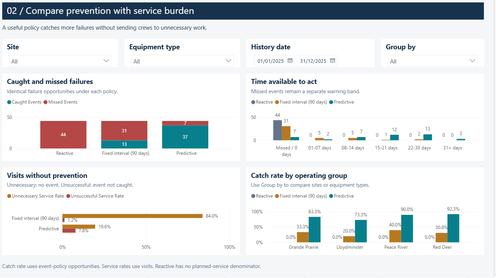
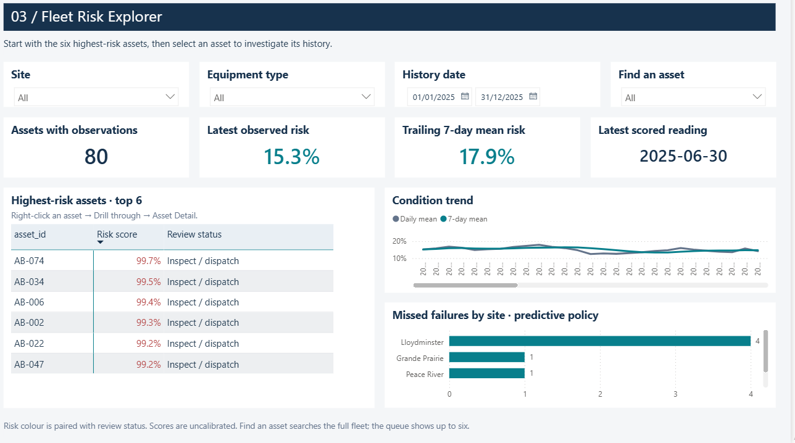
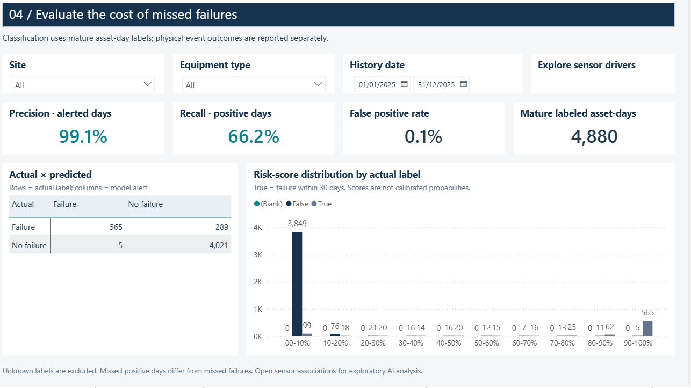
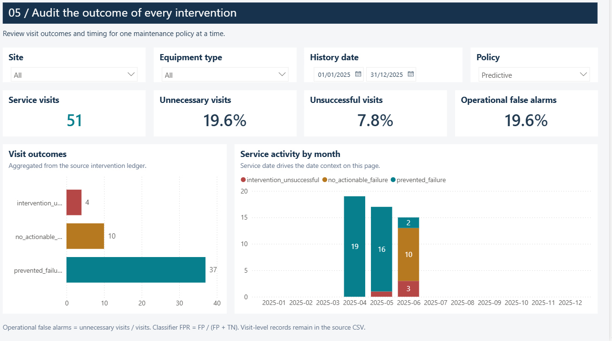
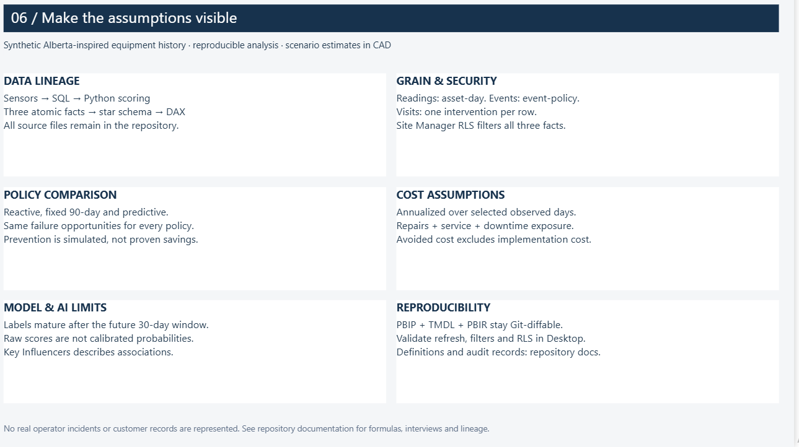
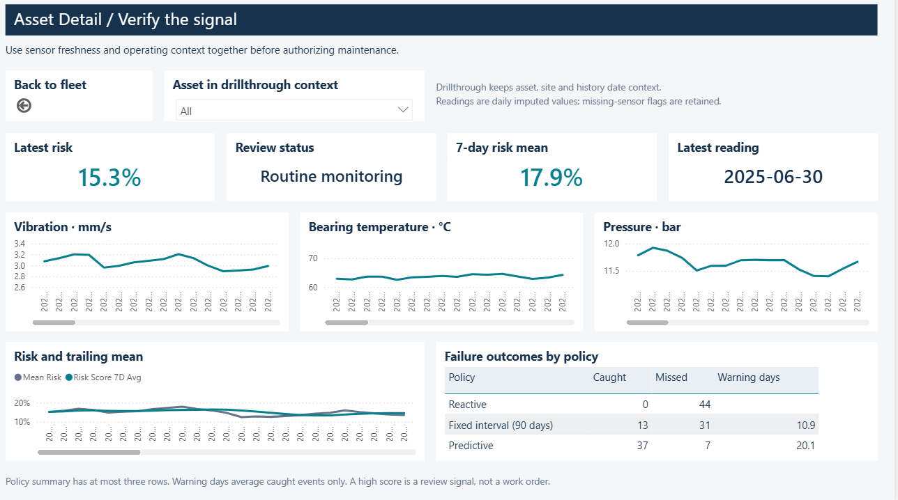
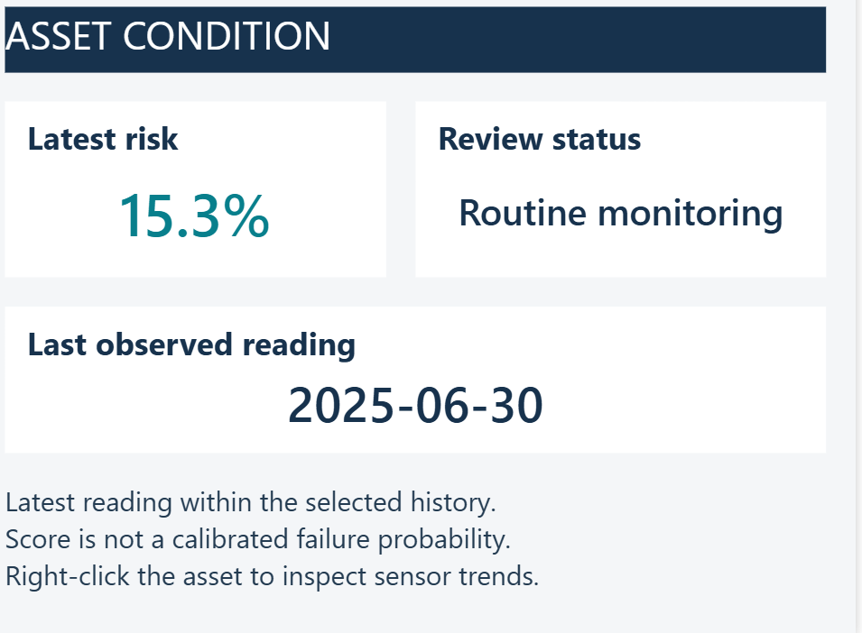

# Power BI native screenshots

**Eight report views:** six main pages and two supporting views. Select any image to inspect it at full size.

The report connects maintenance costs, failure prevention and equipment risk to the reliability team's next decision. These are native Power BI captures; the [browser dashboard companion](../../reports/dashboard.html) is a separate application.

**Capture scope:** These images predate a later report-formatting pass, and internal chart scrollbars remain visible. Asset Detail and Asset Context show fleet aggregates. Screenshots do not verify refresh, asset-specific interactions, mobile behavior or Service RLS; Sensor Associations is not pictured.

## Main report pages

| Report page | Business question | Screenshot |
|---|---|---|
| Executive ROI Summary | How do annualized costs compare across maintenance policies? | [View image](01-executive-roi.png) |
| Policy Comparison | What warning and service burden accompany failure prevention? | [View image](02-policy-comparison.png) |
| Fleet Risk Explorer | Which assets should the reliability team investigate first? | [View image](03-fleet-risk.png) |
| Model Performance | How does the alert threshold balance missed failures and false alarms? | [View image](04-model-performance.png) |
| Service Visit Audit | Which visits prevented a failure or produced unnecessary work? | [View image](05-service-audit.png) |
| Methodology / About | What data, assumptions and limitations support the results? | [View image](06-methodology.png) |

## Supporting views

| Report page | Purpose | Screenshot |
|---|---|---|
| Asset Detail | Inspect sensor trends alongside risk and policy outcomes. | [View image](07-asset-detail.png) |
| Asset Context (tooltip) | Summarize risk, review status and reading freshness. | [View image](08-asset-context.png) |
| Sensor Associations | Explore sensor relationships with the 30-day failure label. | Not pictured |

Open the [Power BI project](../../powerbi/EnergyPredictiveMaintenance.pbip) using the [startup guide](../../START_HERE.md). The [Power BI guide](../../docs/powerbi.md) covers the model, measures and runtime acceptance checks.

## Report previews

### Executive ROI Summary

Compare annualized policy costs and follow the cost bridge from reactive repairs to predictive maintenance.

### Policy Comparison

Compare caught and missed failures, warning time and visits that did not prevent a failure.

### Fleet Risk Explorer

Review the six highest-risk assets, risk trends and missed failures by site.

### Model Performance

Inspect precision, recall, the confusion matrix and risk-score distribution for mature labels.

### Service Visit Audit

Trace intervention outcomes and monthly service activity for the selected maintenance policy.

### Methodology / About

Review data lineage, policy assumptions, cost definitions and model limitations in one place.

### Asset Detail

Inspect vibration, temperature and pressure trends alongside risk and failure outcomes.

### Asset Context (tooltip)

Check the risk summary, review status and date of the latest observed reading.

[Complete screenshot gallery](../README.md) | [Project overview](../../README.md)
